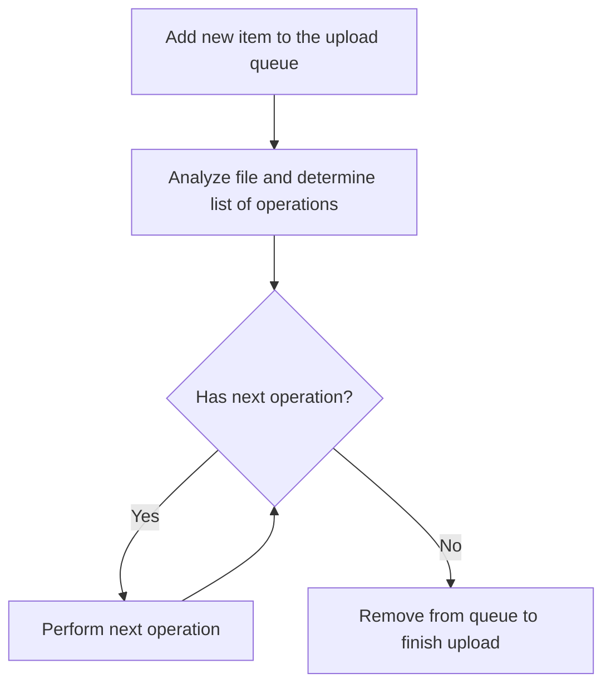
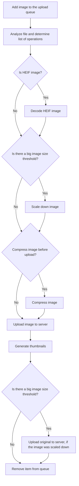

# Technical Overview

## Packages

The two main packages:

* `editor` - Main editor integration
* `upload-media` - Core upload logic with a queue-like system, implemented using a custom `@wordpress/data` store.

## Cross-origin isolation / `SharedArrayBuffer`

This plugin implements client-side media processing through technologies such as [`wasm-vips`](https://github.com/kleisauke/wasm-vips).

WASM-based image optimization requires `SharedArrayBuffer` support, which in turn requires [cross-origin isolation](https://web.dev/articles/cross-origin-isolation-guide).
Implementing that in a robust way without breaking other parts of the editor is challenging. There are currently [some known issues](https://github.com/swissspidy/media-experiments/issues/294) in Firefox and Safari due to these browsers not supporting `credentialless` iframe embeds.
Embed previews in the editor currently do not work because of this, until those browsers add support for `<iframe credentialless>`. So in these browsers you will see:

Check out [this tracking issue](https://github.com/swissspidy/media-experiments/issues/294) for more details and further resources.

## The upload queue

The upload queue in the `upload-media` package uses a custom `@wordpress/data` store, which basically means it's a global variable. This has implications if there are multiple editors on a page. When merging this into Gutenberg, this has to be considered/adjusted.

Check out [the package's readme](../packages/upload-media/README.md) for a list of available actions and selectors.

The queue has several advantages over the existing upload mechanism in Gutenberg:

* You always know whether there is any upload in progress and know exactly in which state each file is.
* Supports cancelling any file optimizations and uploads mid-progress.
* Facilitates client-side file compression and thumbnail generation.
* Makes it possible to limit the number of concurrent operations.

Once a file is added to the upload queue, the system determines the list of operations (such as image compression or cropping) to perform on the file, and then runs each operation one by one.

In a nutshell:

Example operations for an image:

## Web Workers

All the heavy image processing is offloaded to web workers using the [`@shopify/web-worker`](https://www.npmjs.com/package/@shopify/web-worker) package, which makes it easy to load any code in a web worker in a type-safe way.
