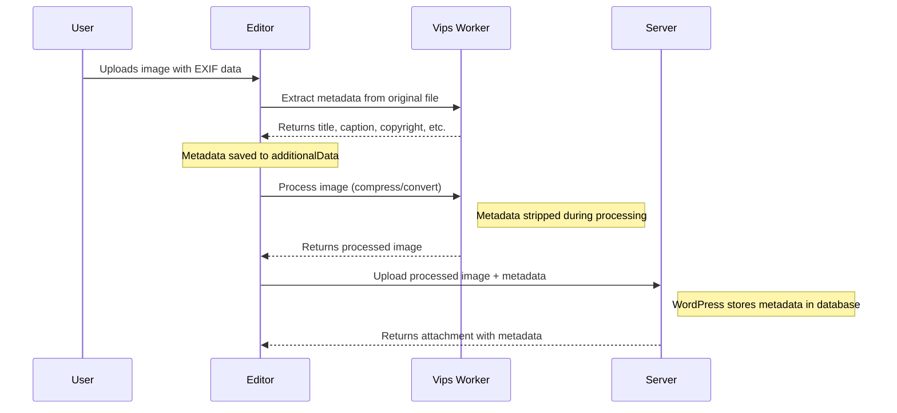

# Technical Overview

## Server-side vs. client-side processing

Traditional media processing on the server:

Versus on the client:

## Why client-side media processing

Current image processing in WordPress relies on server-side resources and older image libraries, leading to potential performance issues and limited support for modern image formats such as AVIF.
This results in a subpar user experience, particularly with resource-intensive tasks like resizing and compressing images.
Additionally, the lack of modern compression tools like MozJPEG further hinders optimization efforts.

Client-side media processing offers a solution by leveraging the browser's capabilities to handle tasks like image resizing and compression.
This approach not only alleviates the strain on server resources but also enables the use of more advanced image formats and compression techniques, ultimately improving website performance and user experience.
By tapping into technologies like WebAssembly, WordPress can provide a more efficient and seamless media handling process for both new and existing content.

### Why WebAssembly

This plugin implements client-side media processing through technologies such as [`wasm-vips`](https://github.com/kleisauke/wasm-vips).

Using WebAssembly for client-side media processing provides significant benefits over using the browser's native capabilities of doing image manipulation through `<canvas>`.
Not only is WASM an order of magnitude faster than `<canvas>`, it is also more feature rich and ensures a consistent user experience across all browsers.

`<canvas>` only supports PNG, JPEG, and WebP (except in Safari) and a image quality setting, nothing else.
Not only does this API take longer to create images, the resulting files will be much larger too.

For **testing purposes**, this plugin does support both a WebAssembly and a `<canvas>` implementation, particularly because the former [is not yet supported in Playground](https://github.com/WordPress/wordpress-playground/issues/952).
This way you can see for yourself how superior the WASM approach is.

## Packages

The main packages:

* [`media-utils`](../packages/media-utils/README.md) - Like `@wordpress/media-utils` but more advanced.
* [`editor`](../packages/editor/README.md) - Main editor UI integration, plus hooking `media-utils` and `upload-media` into `@wordpress/block-editor`
* [`upload-media`](../packages/upload-media/README.md) - Core upload logic with a queue-like system, implemented using a custom `@wordpress/data` store.

## Cross-origin isolation / `SharedArrayBuffer`

WASM-based image optimization requires `SharedArrayBuffer` support, which in turn requires [cross-origin isolation](https://web.dev/articles/cross-origin-isolation-guide).
Implementing that in a robust way without breaking other parts of the editor is challenging. There are currently [some known issues](https://github.com/swissspidy/media-experiments/issues/294) in Firefox and Safari due to these browsers not supporting `credentialless` iframe embeds.
Embed previews in the editor currently do not work because of this, until those browsers add support for `<iframe credentialless>`. So in these browsers you will see:

Check out [this tracking issue](https://github.com/swissspidy/media-experiments/issues/294) for more details and further resources.

## The upload queue

The upload queue in the `upload-media` package uses a custom `@wordpress/data` store, which basically means it's a global variable. This has implications if there are multiple editors on a page. When merging this into Gutenberg, this has to be considered/adjusted.

Check out [the package's readme](../packages/upload-media/README.md) for a list of available actions and selectors.

The queue has several advantages over the existing upload mechanism in Gutenberg:

* You always know whether there is any upload in progress and know exactly in which state each file is.
* Supports cancelling any file optimizations and uploads mid-progress.
* Facilitates client-side file compression and thumbnail generation.
* Makes it possible to limit the number of concurrent operations.

Once a file is added to the upload queue, the system determines the list of operations (such as image compression or cropping) to perform on the file, and then runs each operation one by one.

In a nutshell:

Example operations for an image:

## Web Workers

All the heavy image processing is offloaded to web workers using the [`@shopify/web-worker`](https://www.npmjs.com/package/@shopify/web-worker) package, which makes it easy to load any code in a web worker in a type-safe way.

## EXIF Metadata Handling

WordPress core extracts EXIF, IPTC, and XMP metadata from uploaded images using the `wp_read_image_metadata()` function. This metadata is stored in the database and can be used to populate fields like title, caption, copyright, and more.

However, when images are processed client-side, the metadata would normally be lost before WordPress can extract it. To address this, the plugin now extracts metadata **before** client-side processing:

### How It Works

1. **Extraction**: When an image is uploaded, the `extractImageMetadata()` function reads EXIF, IPTC, and XMP fields from the original file using wasm-vips
2. **Storage**: Extracted fields (title, caption, copyright, credit, camera info, timestamps) are stored in `additionalData`
3. **Processing**: Image is compressed/converted/resized, which strips metadata from the file
4. **Upload**: Both the processed image and extracted metadata are sent to WordPress
5. **Database**: WordPress stores the metadata in the database (title → `post_title`, caption → `post_excerpt`, etc.)

### Extracted Fields

The plugin extracts the same fields that WordPress core's `wp_read_image_metadata()` reads:

- **Title**: EXIF ImageDescription, IPTC Headline, or XMP dc:Title
- **Caption**: EXIF UserComment, IPTC Caption-Abstract, or XMP dc:Description
- **Copyright**: EXIF Copyright, IPTC CopyrightNotice, or XMP dc:Rights
- **Credit**: EXIF Artist, IPTC Credit, or XMP dc:Creator
- **Created Timestamp**: EXIF DateTimeOriginal
- **Camera Info**: Model, Aperture (FNumber), Focal Length, ISO, Shutter Speed (Exposure Time)
- **Orientation**: EXIF Orientation

### Privacy & Security

By default, metadata is **stripped from the uploaded file** during processing. This is a deliberate security and privacy feature that:

- Prevents leaking sensitive information (GPS coordinates, camera serial numbers, etc.)
- Follows modern web best practices
- Reduces file size

The important metadata (title, caption, etc.) is preserved in WordPress's database where it can be properly managed and displayed.
